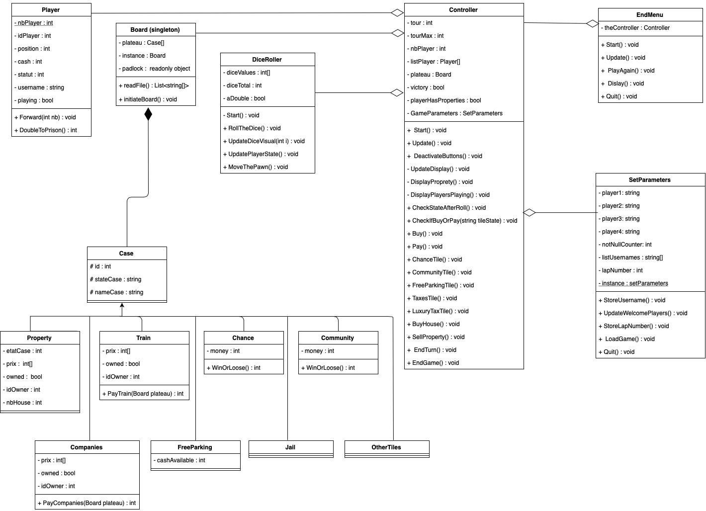

# MONOPOLY-GAME
School project - TD6 - DESIGN PATTERN - MONOPOLY
Welcome on our PROJECT
<ul>
<li>DUGAT Lucie</li>
<li>MAGARIAN Arnaud</li>
<li>CALLAIS Quentin</li>
</ul>

## Link for the project with unity 
We wanted to give you the visual studio version and the unity version. This github is the one with the visual studio version.
The following link is the final project with its implementation with unity : 
https://github.com/QuentinC12/MONOPOLY-GAME-UNITY

## UML of the project : 

Precision about the UML : in classes Controller, EndMenu, SetParameters and DiceRoller GameObject attributes (used in Unity) are not represented because there are too many of them

## Design patterns in the project : 
-> Singleton pattern : used to restrict the instantiation of a class to one single instance.
   We used twice : on the Board class (only one board needs to be created when we execute the program) and on the SetParameters class 
   
-> MVC (Model-View-Controller) pattern : in the first version we used it with the class Controller and we used it after that with Unity (it's better for the interface's quality)

-> Simple factory pattern : we used it to create the cases of the board. We have a parent class Case with attributes ans methods and children classes for the different types of cases and their different behavior (Properties, Jail ...) 

## Precisions : 
In order to create the board with the different types of cases, we wrote a csv file (you can find it in the github  : "Monop.csv")

